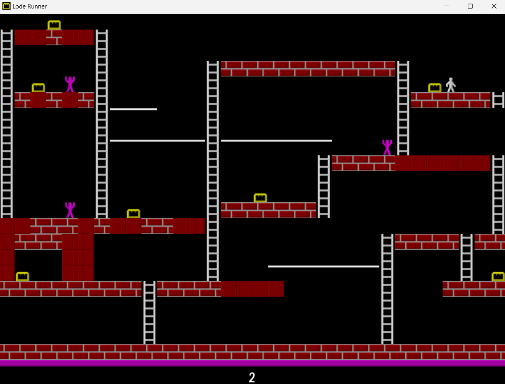

# Lode Runner

## DOWNLOAD INSTRUCTION
&nbsp;&nbsp;&nbsp;&nbsp;&nbsp;&nbsp;&nbsp;&nbsp;Go to https://github.com/dmtrDO/Lode-Runner -> green button ***code*** -> ***download zip***.
After this you need to unzip folder. Inside the folder will be folder ***Lode Runner***, the rest can be deleted. Inside folder ***Lode Runner*** will be another folder ***LR***, README-file and a shortcut to the game named ***Lode Runner***. Take and move this shortcut wherever you feel comfortable running the game. The rest can be dragged to a place you can remember and still keep it out of your way. If something went wrong, just redownload.

## GAME INSTRUCTION
&nbsp;&nbsp;&nbsp;&nbsp;&nbsp;&nbsp;&nbsp;&nbsp;In the game you are a white character, behind you run a few purple enemies, your task is to collect all the chests, after which there will be a ladder on which you need to climb. You can also break some blocks to either prevent the enemies from catching you or to get to a chest.  
&nbsp;&nbsp;&nbsp;&nbsp;&nbsp;&nbsp;&nbsp;&nbsp;The control is also very simple, you have the arrow-keys ***left***, ***right***, ***up*** and ***down*** for movement and one special key ***space*** to break blocks. Also by pressing ***Esc*** (escape) the game will restart the current level. In the upper right corner there is a standard control menu for the window to minimize it, resize it or close it.   
&nbsp;&nbsp;&nbsp;&nbsp;&nbsp;&nbsp;&nbsp;&nbsp;The game has a simple level builder, to do this go to the folder ***Lode Runner*** -> ***LR*** -> ***src*** -> ***levels***. There will be many levels (***level1.txt***, ***level2.txt*** and etc...) and a text file ***rules.txt***, read it if you want to change or add levels. The name must be level{num}.txt where {num} is the level number. Here is also ***save.txt***, it stores the number of the level (the game has an autosave), which will be opened when you start the game, it can also be changed. If something went wrong, just redownload as written in the previous paragraph **DOWNLOAD INSTRUCTION**. 

## WHY DO YOU SEE THIS
&nbsp;&nbsp;&nbsp;&nbsp;&nbsp;&nbsp;&nbsp;&nbsp;My goal was to practice after learning C++ programming language in my first year of university. My father likes this game but on all the sites where we downloaded it there are restrictions on the number of levels and I thought this was the perfect opportunity. To develop the game I learned a little bit about Visual Studio and the basics of the SFML library.

